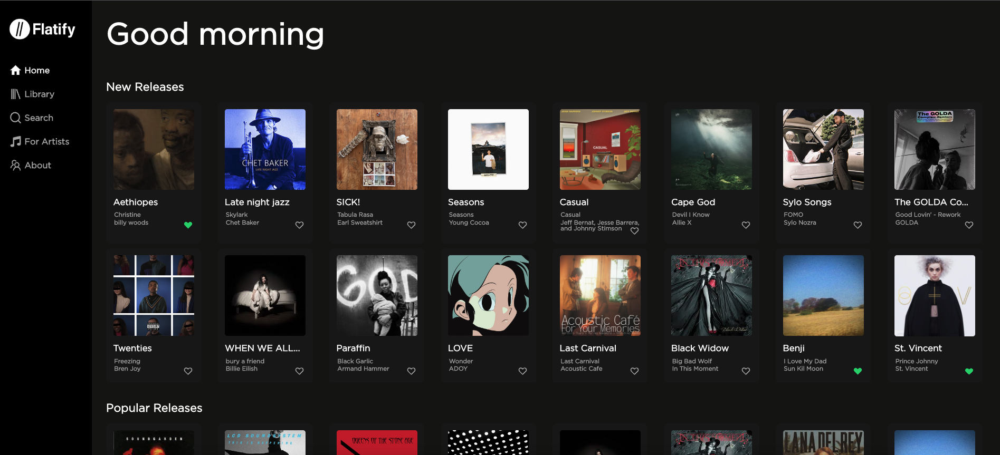

# Flatify: A React.js App featuring React Router, Styled Components and JSON Server

a project by [Alie Brubaker](https://www.linkedin.com/in/alie-brubaker/), [Victor Haynes](https://www.linkedin.com/in/victor-haynes/), [Yoojin Cheong](https://www.linkedin.com/in/yoojin-cheong/)

## About Flatify

Flatify is a Spotify clone that demonstrates our foundational understanding of React, React Router, Styled Components, implementing a local API of spoofed data.

## Features

* The user navigates through the app in the sidebar menu rendering features individually in a single page application.

* The Home page displays a set of data based on release date and a set of data based on popularity.

* The Search page allows the user to search through the entire song database by artist, song name, album and genre. The results change in real time based on the user input.

* In both Home and Search, the user may click the heart icon to generate a list of favorites which is persistent and renders in the Library page. Songs can be unfavorited on any page and persist throughout the app as well.

* The For Artists tab allows the user to add their own music to the song database which will render immediately and persist in the database.

## How to run

In order to run the project on the developer side, the user will need to install react-icons, styled components, and json-server.

To run the app, the user will need to run the json-server by typing $ json-server --watch db.json from the command line. Then, in a new terminal the user will need to run npm start